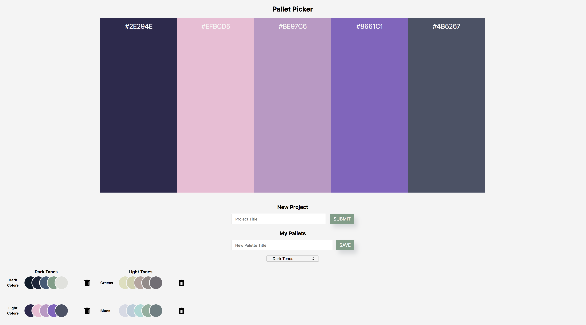

## Palette Picker

Palette Picker is a single page CRUD application that allows users to save randomly generated color palettes to projects they have created. The front end application was built using Vanilla JavaScript the back-end was built with Express and uses a Postgres database for data persistance. Users are able to create a projects and save palettes to those projects. Mocha and Chai were used for testing.

